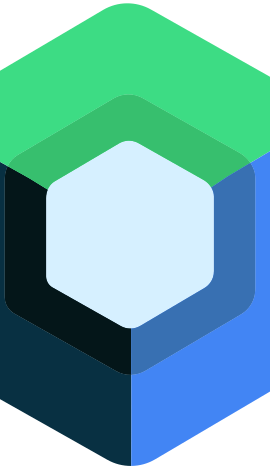

Hi 👋 My name is Abdullah Musa
==============================

I’m a computer engineering student with a passion for Android development. Over the past 4 years, I’ve been learning the ways of software development and have recently started exploring the world of mobile app development. I began my journey with Android development using the "old" XML way, but quickly transitioned to Jetpack Compose, which has made UI development a breeze. I’ve also been experimenting with Kotlin Multiplatform, which has allowed me to share code across multiple platforms. I’m excited to continue learning and growing as a developer, and I’m always looking for new challenges to tackle!

* 🌍  I'm based in Hungary
* 🚀  My latest project is [Child Monitor](https://github.com/abdullahmusa/ChildMonitor)
* 🧠  I'm learning Kotlin Multiplatform

### Skills

    
    
    
    

